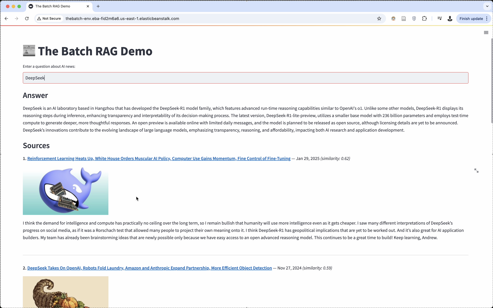

# The Batch RAG Demo

A complete pipeline for ingesting, preprocessing, indexing, and serving “The Batch” AI newsletter via a Vector-RAG system and Streamlit UI.

---

## Demo

[](assets/demo.mp4)

## 📋 Prerequisites

- **Python 3.11**  
- **Docker** & **Docker Compose** (for containerization)  
- **AWS CLI** & **EB CLI** (for deployment)  
- **OpenAI API key** (set in `.env`)  

Create a `.env` file in the project root:
```bash
OPENAI_API_KEY=sk-…
```

---

## 🧱 Project Structure

```
thebatch-rag/
├── src/
│ ├── ingest.py
│ ├── preprocess.py
│ ├── embed_and_index.py
│ ├── retrieve.py
│ └── app.py
├── output/
│ ├── images/
│ ├── chunks.json
│ ├── meta.json
│ ├── thebatch_full.json
│ ├── thebatch_tiles.json
│ └── thebatch.json
├── Dockerfile
├── requirements.txt
└── README.md
```

---

## 🔧 Setup

Load environment variables:

```bash
set -o allexport
source ./.env
set +o allexport
```

Create python environment:
```bash
python3.11 -m venv venv
```

Install Python dependencies:

```bash
pip install -r requirements.txt
```

---

## 🚀 Data Pipeline

1. **Ingest**

   ```bash
   python src/ingest.py \
     --pages 22 \
     --workers 4 \
     --outdir output \
     --imagedir output/images
   ```

2. **Preprocess & Chunk**

   ```bash
   python src/preprocess.py \
     --input output/thebatch_full.json \
     --outdir output
   ```

3. **Embed & Index**

   ```bash
   python src/embed_and_index.py \
     --chunks output/chunks.json \
     --outdir output
   ```

4. **Test Retrieval**

   ```bash
   python src/retrieve.py \
     --index output/thebatch.faiss \
     --meta output/meta.json \
     --query "What is DeepSeek" \
     --topk 5
   ```

---

## 💻 Run Locally

Start the Streamlit app:

```bash
python -m streamlit run src/app.py \
  --server.port=8501 \
  --server.headless=true
```

Open browser at `http://localhost:8501`.

---

## 🐳 Containerization

1. **Build** the image

   ```bash
   docker build -t thebatch-rag:latest .
   ```

2. **Run** (bind port and mount data)

   ```bash
   docker run --rm \
     -p 8501:8501 \
     --env-file .env \
     -v "${PWD}/output:/app/output" \
     thebatch-rag:latest
   ```

3. **Interactive shell**

   ```bash
   docker run --rm \
     -v "${PWD}/output:/app/output" \
     --env-file .env \
     -it \
     --entrypoint bash \
     thebatch-rag:latest
   ```

---

## ☁️ Deploy on AWS Elastic Beanstalk

1. **Verify AWS CLI**

   ```bash
   aws sts get-caller-identity
   ```

2. **Ensure ECR repo**

   ```bash
   aws ecr describe-repositories \
     --repository-names thebatch-rag \
   || aws ecr create-repository --repository-name thebatch-rag
   ```

3. **Login to ECR**

   ```bash
   aws ecr get-login-password --region us-east-1 \
     | docker login \
         --username AWS \
         --password-stdin <AWS_ACCOUNT_ID>.dkr.ecr.us-east-1.amazonaws.com
   ```

4. **Tag & Push**

   ```bash
   docker tag thebatch-rag:latest \
     <AWS_ACCOUNT_ID>.dkr.ecr.us-east-1.amazonaws.com/thebatch-rag:latest

   docker push <AWS_ACCOUNT_ID>.dkr.ecr.us-east-1.amazonaws.com/thebatch-rag:latest
   ```

5. **Initialize EB**

   ```bash
   eb init thebatch-rag \
     --platform docker-20.10 \
     --region us-east-1
   ```

6. **Set environment vars**

   ```bash
   eb setenv OPENAI_API_KEY=$OPENAI_API_KEY
   ```

7. **Create or deploy**

   * **First time**:

     ```bash
     eb create thebatch-env --single
     ```
   * **Subsequent deploys**:

     ```bash
     eb deploy
     ```

8. **Open in browser**

   ```bash
   eb open
   ```

---

## 🔄 Redeployment Workflow

Whenever you update code or ingest new data:

1. Rerun the pipeline:

   ```bash
   python src/ingest.py ... 
   python src/preprocess.py ...
   python src/embed_and_index.py ...
   ```

2. Rebuild & push Docker image:

   ```bash
   docker build -t thebatch-rag:latest .
   docker tag thebatch-rag:latest <AWS_ACCOUNT_ID>.dkr.ecr.us-east-1.amazonaws.com/thebatch-rag:latest
   docker push <AWS_ACCOUNT_ID>.dkr.ecr.us-east-1.amazonaws.com/thebatch-rag:latest
   ```

3. Redeploy on EB:

   ```bash
   eb deploy
   eb open
   ```
# Report

The report is available [here](REPORT.md)