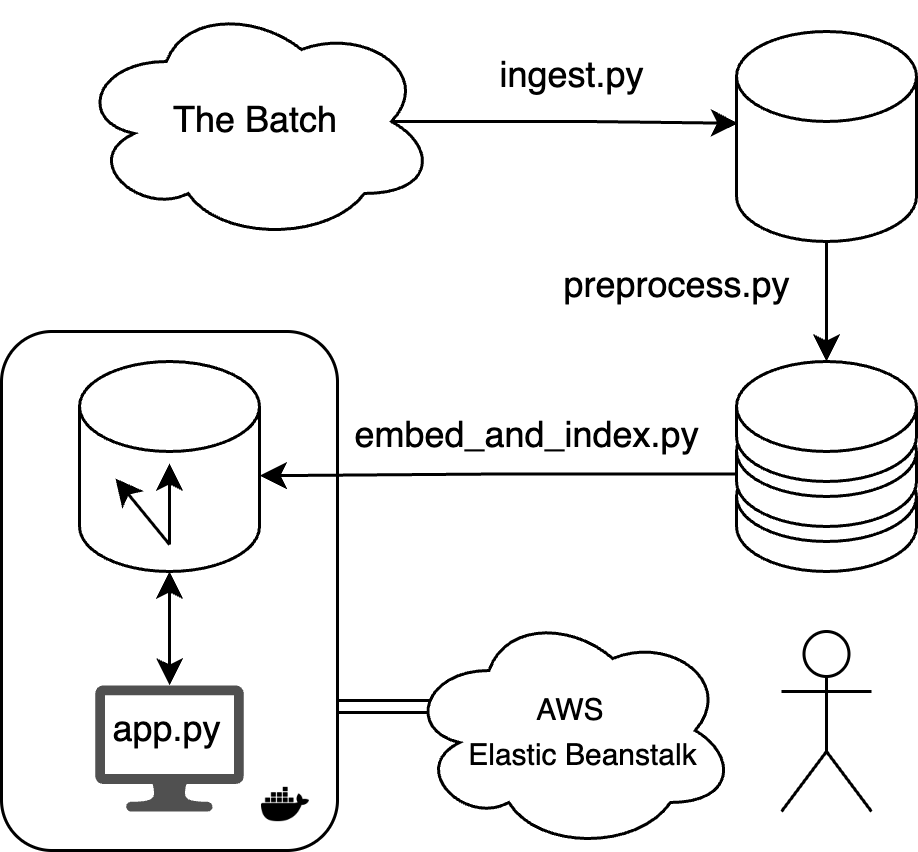

# Report: Multimodal RAG System for “The Batch” Newsletter

**Author:** Markiian Mandzak

**Date:** June 19, 2025

---

## Table of Contents

1. [Executive Summary](#1-executive-summary)
2. [Introduction & Objectives](#2-introduction--objectives)
3. [Key Design Decisions](#3-key-design-decisions)
4. [System Architecture](#4-system-architecture)
5. [Deployment & Operations](#5-deployment--operations)
6. [Conclusions & Next Steps](#6-conclusions--next-steps)

---

## 1. Executive Summary

We built a Retrieval-Augmented Generation (RAG) pipeline over “The Batch” AI newsletter to answer free-form user queries with relevant article snippets and lead images. The core components include:

* **Ingestion:** Paginating scrapes via Selenium + Requests.
* **Preprocessing & Chunking:** Sentence-based splits with local token budgets (tiktoken).
* **Embedding & Indexing:** OpenAI `text-embedding-ada-002` + FAISS `IndexFlatL2`.
* **RAG Generation:** Deduplicated top‑K snippet prompt for GPT-4.1-Nano answers.
* **UI & Deployment:** Dockerized, Streamlit front‑end deployed to AWS Elastic Beanstalk.

---

## 2. Introduction & Objectives

### 2.1 Problem Statement

Enable efficient, accurate querying of the articles from “The Batch” newsletter, combining text and images.

### 2.2 Objectives

* **Data Ingestion & Preprocessing:** Scrape articles + images.
* **Indexing:** Create a vector store for retrieval.
* **Query & Generation:** Retrieve relevant snippets and assemble prompts for an LLM.
* **User Experience:** Provide an intuitive UI for end-users.
* **Deployment:** Containerize and host on a managed cloud service.

---

## 3. Key Design Decisions

| Component            | Choice                               | Rationale                                                      |
| -------------------- | ------------------------------------ | -------------------------------------------------------------- |
| **Scraper**          | Selenium + Requests                  | Handles JS pagination; Requests for efficient media downloads. |
| **Chunking**         | Period-split + tiktoken token counts | Preserves coherence; local counts avoid API costs and limits.  |
| **Embedding**        | OpenAI `text-embedding-ada-002`      | High-quality, scalable, easy integration.                      |
| **Index**            | FAISS `IndexFlatL2`                  | Simple k-NN with low latency on \~1K chunks.                   |
| **RAG Model**        | GPT-4.1-Nano                         | Balances cost with answer fidelity.                            |
| **UI**               | Streamlit                            | Rapid prototyping and minimal boilerplate.                     |
| **Containerization** | Docker (with pre-baked data)         | Fast startup without in-container rebuilds.                    |
| **Cloud Platform**   | AWS Elastic Beanstalk                | Managed, easy CI/CD, auto-scaling potential.                   |

---

## 4. System Architecture

1. **Ingestion (`src/ingest.py`)**: Scrape listing pages → parse tiles → fetch full articles & images.
2. **Preprocessing (`src/preprocess.py`)**: Clean text → split into <=500-token chunks → output `chunks.json`.
3. **Embedding & Indexing (`src/embed_and_index.py`)**: Batch embed chunks → build FAISS index → write `thebatch.faiss` + `meta.json`.
4. **Retrieval & RAG (`src/app.py`)**: Embed user query → FAISS k-NN → dedupe by URL → assemble prompt → GPT-4.1-Nano call.
5. **UI (Streamlit)**: Input box, spinners, answer display, clickable sources with dates & images.
6. **Container & Deployment**: Dockerfile copies `src/` + precomputed `output/`; Elastic Beanstalk pulls image from ECR.

  

---

## 5. Deployment & Operations

* **Docker Image:** \~1.8 GB including Python, code, and pre-baked `output/`.
* **AWS Elastic Beanstalk Costs:**

  * **EC2 (t3.micro):** \$0.0104/hr × 24 hr/day × 30 days ≈ \$7.49/mo
  * **EBS (8 GiB at \$0.10/GiB‑month):** \$0.80/mo
  * **Data Egress (\~49.99 MB/day ≈ 1.395 GiB/mo at \$0.09/GiB):** \$0.13/mo
  * **Total:** **\$8.42/mo**
* **CI/CD:** GitHub Actions to build & push Docker; EB CLI (`eb deploy`) on merges to `main`.
* **Monitoring:** CloudWatch logs; simple `/healthz` endpoint for health checks.

---

## 6. Conclusions & Next Steps

* Developed a full RAG pipeline to scrape, preprocess, embed, index, and answer user queries based on “The Batch” newsletter.
* Created an interactive Streamlit UI for end users to submit queries and view answers with source snippets and images.
* Containerized the entire application into a Docker image for fast startup and consistent environments.
* Deployed the Dockerized app to AWS Elastic Beanstalk, complete with environment configuration, and basic health monitoring.